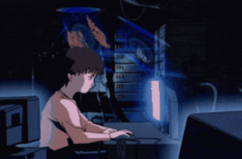

<!--

  

-->

  

<h1 align="center">Calvin V.</h1>

  <strong>Developer Advocate · Applied AI Engineer · Full-Stack Builder</strong>

  I build technical demos, learning tools, and playful products that make complicated ideas click.

  
  
  

---

## About me

Hey, I'm Calvin. I’m a Developer Advocate and applied AI/full-stack builder working with **Resilient Coders**.

Before engineering, I worked in enterprise software sales and business development. Sales taught me to listen first, skip the jargon, and connect technical work to real human needs.

I’m drawn to civic tech, community-focused products, accessibility, and tech for good. I love open source and the people who keep it moving. I’m also a member of the official **Cursor Boston** group and volunteer as a community manager.

I love the artistic side of engineering too, from visual storytelling and UI design to generative art, pixel art, music, animation, and playful interfaces.

Recently, I have:

- turned AI research into an interactive **marimo Python notebook**
- completed an end-to-end Nanochat training run on H200 GPUs
- fine-tuned image models and built creative interfaces around them
- made voice-controlled music tools and live-coded beats in JavaScript
- created community workshops, civic-minded apps, and technical demos

I care about ethical AI, responsible data use, human judgment, and the environmental cost of model usage. AI can require serious energy, water, and hardware, and not every problem needs a model.

I also grew up on retro video games and pixel art. In fact, I actually used to own a retro-gaming shop online, so you'll often find little throwbacks and playful energy in all the projects I build.

> Make it useful. Make it understandable. Give it a little personality.

---

## Flagship technical work

<table>
  <tr>
    <td width="50%" valign="top">
      <a href="https://github.com/CodingWCal/attention-sink-playground">
        

      </a>
      <h3>Attention Sink Playground</h3>
      

        An interactive marimo Python notebook that turns transformer research into something you can poke at, test, and actually see.
      

      

        <a href="https://github.com/CodingWCal/attention-sink-playground"><strong>Repository</strong></a>
        ·
        <a href="https://molab.marimo.io/notebooks/nb_BjxT4fWi3DtMSNFA7kVXk7/app"><strong>Live notebook</strong></a>
      

    </td>
    <td width="50%" valign="top">
      <a href="https://github.com/CodingWCal/nanochat-nebius-run">
        

      </a>
      <h3>Nanochat on Nebius</h3>
      

        An end-to-end Nanochat run on H200 GPUs, from training and fine-tuning to a working chat UI and preserved model artifacts.
      

      

        <a href="https://github.com/CodingWCal/nanochat-nebius-run"><strong>Run documentation</strong></a>
        ·
        <a href="https://huggingface.co/CodingwCal/nanochat-d24-nebius-run"><strong>Model artifacts</strong></a>
      

    </td>
  </tr>
</table>

<table>
  <tr>
    <td width="50%">
      
    </td>
    <td width="50%">
      
    </td>
  </tr>
  <tr>
    <td width="50%">
      
    </td>
    <td width="50%">
      
    </td>
  </tr>
</table>

### Why these stand out

- **[Odyssey](https://github.com/CodingWCal/odyssey)** shows modern full-stack product engineering with collaboration, maps, notes, and expense splitting.
- **[DC Comic Cover Generator](https://github.com/CodingWCal/dc-comic-cover-generator)** pairs a custom LoRA model with a type-safe Next.js app and serverless API.
- **[Club Goose](https://github.com/CodingWCal/club-goose)** combines voice control, browser audio synthesis, reactive visuals, and hands-free interaction.
- **[Frutiger Flocus](https://github.com/CodingWCal/frutiger-flocus)** shows polished UI, motion, TypeScript, testing, and plenty of personality.

---

## Creative arcade

The side quests: smaller, stranger, and more playful builds that make my GitHub feel like mine.

<table>
  <tr>
    <td width="50%">
      
    </td>
    <td width="50%">
      
    </td>
  </tr>
  <tr>
    <td width="50%">
      
    </td>
    <td width="50%">
      
    </td>
  </tr>
</table>

**[The Assist](https://github.com/CodingWCal/the-assist)** adds a synced Rookie Mode for basketball fans who are still learning the game.  
**[CHAKRAX](https://github.com/CodingWCal/chakrax-image-model)** turns a fine-tuned model into a Naruto-inspired image generator.  
**[Strudel Boom Bap + R&B](https://github.com/CodingWCal/strudel-boom-bap-rnb)** uses JavaScript like a tiny live-coded beat machine.  
**[Digimon DigiMatch](https://github.com/CodingWCal/digimon-digimatch-game)** brings Saturday-morning Digimon energy into the browser.

---

> *“You do not rise to the level of your goals. You fall to the level of your systems.”*  
> James Clear

### More builds

[Inkspiration](https://github.com/CodingWCal/Inkspiration-2.1) ·
[SafeRoute](https://safe-route-6iqv.onrender.com/) ·
[AI Learning System](https://github.com/CodingWCal/ai-learning-system) ·
[JS Sensei](https://github.com/CodingWCal/JS-Sensei) ·
[Strudel Lofi](https://github.com/CodingWCal/strudel-lofi) ·
[Strudel Harp Harmony](https://github.com/CodingWCal/strudel-harp-harmony) ·
[NeetCode Solutions](https://github.com/CodingWCal/NeetCode-Solutions)

---

## What I work with

**Languages and product stack**

**Data, auth, and cloud**

**Applied AI, creative tooling, and quality**

**AI-assisted development**

    

**Additional tools and platforms**

     

Also comfortable with REST APIs, row-level security, marimo, Strudel, Tone.js, and the occasional terminal rabbit hole.

---

## GitHub snapshot

<table>
  <tr>
    <td width="58%" align="center">
      
    </td>
    <td width="42%" align="center">
      
    </td>
  </tr>
</table>

  Language cards measure code stored in public repositories, not skill level.

  
<strong>View public GitHub activity</strong>

   
  

---

  

Gaming Mode | Grind Mode
:---:|:---:
 | 

---

## Say hello

I’m always happy to talk about DevRel, ethical AI, civic tech, art, anime, games, or an app idea with suspiciously high personality.

  <a href="https://calvinvancreations.com/">Portfolio</a>
  ·
  <a href="https://www.linkedin.com/in/calvin-van-001/">LinkedIn</a>
  ·
  <a href="https://bsky.app/profile/codingwcal.bsky.social">Bluesky</a>

